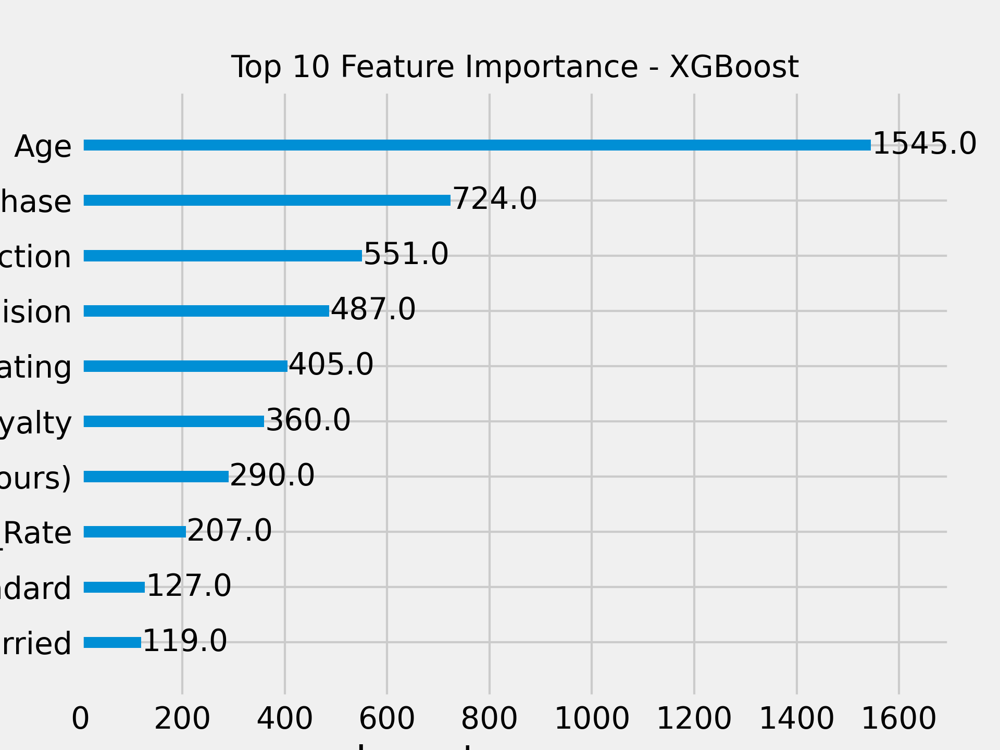

# IDS706_DE_Wk2 / Week 3 Submission

[](https://github.com/codeteme/IDS706_DE_Wk2/actions/workflows/main.yml)

## E-commerce Consumer Behavior Analysis

### Project Overview
This project is a comprehensive analysis of e-commerce consumer behavior data. It involves several key steps in the data science pipeline: loading and cleaning data, performing exploratory data analysis (EDA), and building and evaluating machine learning models for regression and classification tasks.

---

## Dataset
The analysis uses the dataset:

```

data/raw/Ecommerce_Consumer_Behavior_Analysis_Data.csv

````

It contains demographics, purchase history, and behavioral metrics for e-commerce customers.  

---

Key Columns:

* Numerical: Purchase_Amount, Age, Visits_Per_Month, etc.
* Categorical: Gender, Income_Level, Marital_Status, Occupation, Purchase_Channel, etc.
* Target Variables:
  * Regression: Purchase_Amount
  * Classification: Customer_Satisfaction

---

## Setup Instructions

### Docker Image
Build the Docker image with all dependencies:

```bash
docker build -t ids706_wk3 .
````

* Uses Python 3.10 and `requirements.txt`.
* Isolated environment ensures reproducibility.

---

### Run Tests

Run container to execute unit tests:

```bash
docker run --rm ids706_wk3
```

* Tests are located in `src/test_main.py`.
* Command executed:

```bash
python -m unittest discover -s src
```

* Screenshot of passing tests should be included for submission.

---

## Dev Container Setup (VS Code)

1. **Folder structure**:

```
.devcontainer/
├── devcontainer.json
Dockerfile
requirements.txt
src/
data/
```

2. **devcontainer.json**:

```json
{
  "name": "IDS706 Week 3 Dev Container",
  "build": {
    "dockerfile": "../Dockerfile",
    "context": ".."
  },
  "workspaceFolder": "/app",
  "extensions": [
    "ms-python.python",
    "ms-python.vscode-pylance"
  ],
  "settings": {
    "python.pythonPath": "/usr/local/bin/python"
  },
  "postCreateCommand": "pip install --no-cache-dir -r requirements.txt"
}
```

3. **Open in VS Code:**

* Install **Remote - Containers** extension.
* Press `F1` → **Remote-Containers: Open Folder in Container** → select project folder.
* Dependencies install automatically and workspace opens inside the container.

4. **Run Tests inside Dev Container:**

```bash
python -m unittest discover -s src
```

---

## Figures




